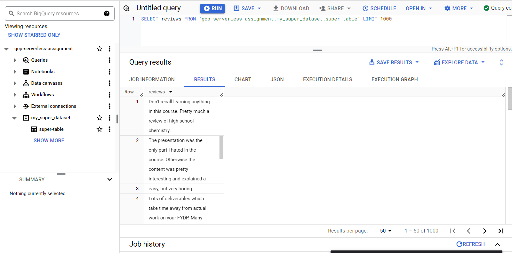

# HHA504_assignment_dbs

# HHA504: Managed Databases in Azure and GCP

## Table of Contents
- [Introduction](#introduction)
- [Azure MySQL Database Setup](#azure-mysql-database-setup)
  - [Configuration](#configuration)
  - [Connection Details](#connection-details)
  - [Monitoring in Azure](#monitoring-in-azure)
- [GCP MySQL Database Setup](#gcp-mysql-database-setup)
  - [Configuration](#gcp-configuration)
  - [Connection Details](#gcp-connection-details)
  - [Monitoring in GCP](#monitoring-in-gcp)
- [BigQuery Exploration](#bigquery-exploration)
  - [Dataset and Table Creation](#dataset-and-table-creation)
  - [Query Execution](#query-execution)
  - [Cost and Usage Monitoring](#cost-and-usage-monitoring)
- [Reflections on Azure vs GCP](#reflections)
- [Conclusion](#conclusion)

---

## Introduction
This document outlines my first hand experience of working with managed database services in **Azure** and **Google Cloud Platform (GCP)**. On both platforms, I set up and kept an eye on MySQL databases and experimented with using **BigQuery** to load and query a dataset. The steps include the database setup, monitoring processes, and a reflection on the differences between managing databases in Azure and GCP.

## Azure MySQL Database Setup

### Configuration
- In the Azure portal, I created a **MySQL flexible server**.
- **Compute & Storage Options**: 
  - vCores: 2
  - Memory: 4GB
  - Storage: 20GB
- Server version: MySQL 8.0
- Region: East US

### Connection Details
- **Server Name**: `hha-super.mysql.database.azure.com`
- **Username**: `admin_super`
- **Port**: 3306

**Screenshot:**

### Monitoring in Azure
Using the **Azure Metrics** dashboard, following metrics were monitored:
- **CPU Usage**: Max. 69.84%
- **Memory Usage**: Max. 66.91%
- **Storage IO Percent**: Max. 7.62%
- **Connections**:  4

**Screenshot:**

---

## GCP MySQL Database Setup

### GCP Configuration
- In the GCP Console, I created a **Cloud SQL instance** for MySQL.
- **Configuration Options**:
  - vCores: 2
  - Memory: 8GB
  - Storage: 10GB
- MySQL Version: 8.0.31
- Region: us-east1

### Connection Details
- **Instance Connection Name**: `gcp-serverless-assignment:us-east1:admin-super`
- **Public IP**: `35.196.29.216`
- **Port**: 3306
- **SSL**: Enabled

**Screenshot:**

### Monitoring in GCP
I monitored the instance using **Cloud SQL Insights**, focusing on:
- **CPU Usage**
- **Memory Usage**
- **Connection Latency**

**Screenshot:**

---

## BigQuery Exploration

### Dataset and Table Creation
- I created a new dataset in BigQuery called `my_super_dataset`.
- Loaded a **CSV file** into a table named `super-table`.

**Screenshot:**

### Query Execution
- Example query:
  
   

### Cost and Usage Monitoring

 -  I tracked the cost using the **Billing Dashboard** after running the query.
 -  **3.2MB** of data was processed in total, and **10MB** (free tier) was the amount billed.

## Reflections on Azure vs GCP

### Ease of Setup

-   **Azure**: A simple setup process for MySQL databases, but more extensive configuration choices for computation and storage.
-   **GCP**: A somewhat faster interface, but some functionality, including SSL and public IP access, must be manually enabled.

### Monitoring Tools

-   **Azure**: Offers a consolidated view and is more integrated with native monitoring tools like **Azure Metrics**.
-   **GCP**: Although it might need more manual setup, **GCP** offers clear visibility with **Cloud SQL Insights** and **BigQuery Monitoring**.

### Cost Management

-   **Azure**: The **Cost Management** dashboard offers detailed views on resource consumption and the cost analysis tools.
-   **GCP**: Costs for **GCP** can be found in the **Billing** area, which is simpler to view but necessitates switching between Cloud SQL and BigQuery.

## Conclusion

All things considered, **Azure** and **GCP** both provide strong database management tools. However, Azure offers more integration for performance analytics, while GCP shines with its simple BigQuery approach. Platform selection is mostly based on user-friendliness, resource requirements, and project-specific requirements.
